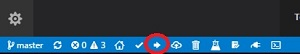

# Vidi-X-MultiApp

  ### Using this app, Vidi-X can run all included apps without reflashing/rebooting
   #### - This project is made on PlatformIO IDE
    #### - Installed ESP32 support for PlatformIO IDE is v.2.0.0
  
# Installing and Compiling the firmware
### First, you must install the necessary tools and prepare the IDE environment
- Download and Install Visual Studio Code https://code.visualstudio.com/
- Install the PlatformIO Extension on Visual Studio Code
- Clone or Download & unzip this repository
- Open the MultiApp Project folder on PlatformIO
- Click the BUILD button 
  + This will build and Flash the firmware to Vidi-X connected to your PC USB
